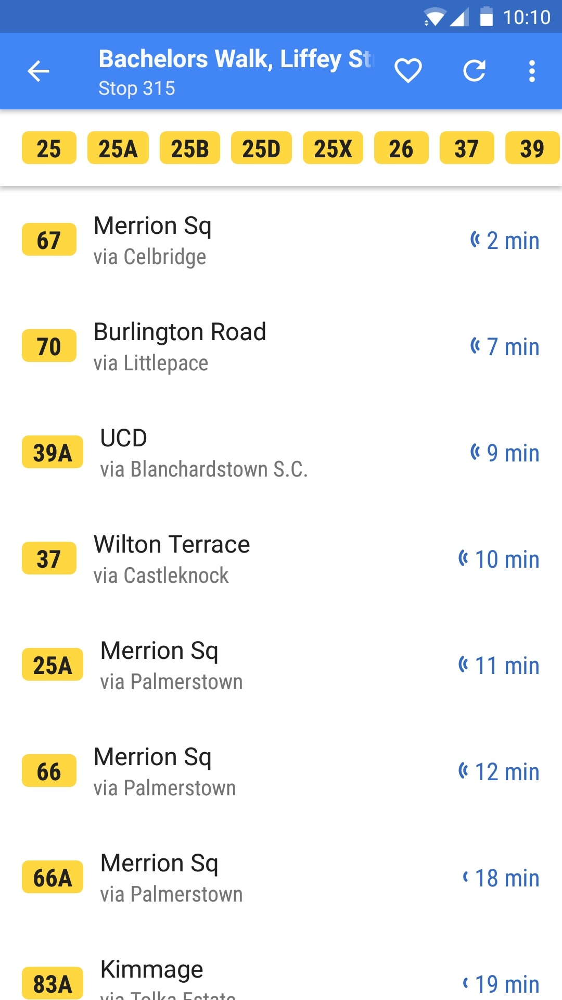
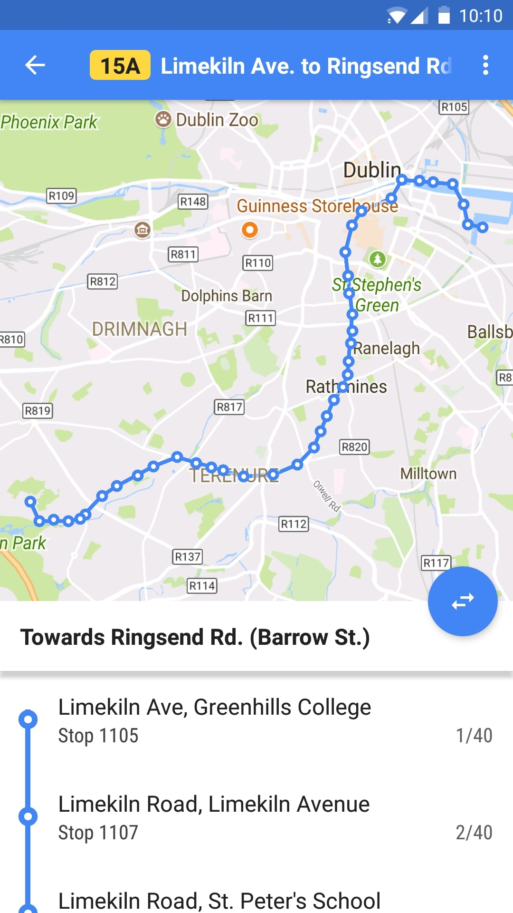
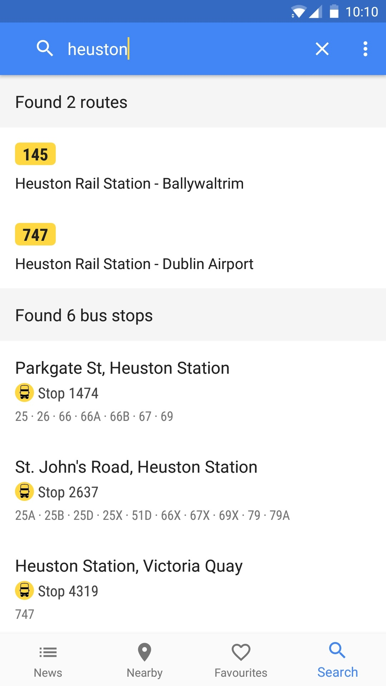

<h3 align="center">
  Dublin Bus Pal
</h3>

  <i>An Android application for Dublin Bus written in Kotlin Download it now on the <a href="https://play.google.com/store/apps/details?id=ie.dublinbuspal.android">Google Play Store</a></i>

  
  
  

  

    

